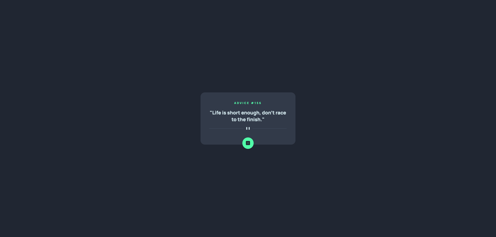

# Frontend Mentor - Advice generator app solution

This is a solution to the [Advice generator app challenge on Frontend Mentor](https://www.frontendmentor.io/challenges/advice-generator-app-QdUG-13db). Frontend Mentor challenges help you improve your coding skills by building realistic projects.

## Table of contents

- [Overview](#overview)
  - [The challenge](#the-challenge)
  - [Screenshot](#screenshot)
  - [Links](#links)
- [My process](#my-process)
  - [Built with](#built-with)
  - [What I learned](#what-i-learned)
- [Author](#author)

**Note: Delete this note and update the table of contents based on what sections you keep.**

## Overview

### The challenge

Users should be able to:

- View the optimal layout for the app depending on their device's screen size
- See hover states for all interactive elements on the page
- Generate a new piece of advice by clicking the dice icon

### Screenshot



### Links

- Github Repo URL: [Repository](https://github.com/justincbal/Frontend-Mentor/tree/main/advice-generator-app-main)
- Live Site URL: [Live preview](https://your-live-site-url.com)
- Challenge URL: [Frontend Mentor Challenge](https://www.frontendmentor.io/challenges/advice-generator-app-QdUG-13db)

## My process

### Built with

- Semantic HTML5 markup
- CSS custom properties
- Flexbox
- [React](https://reactjs.org/) - JS library

### What I learned

This app required a simple fetch request, but I did use this as an opportunity to practice my fetching in react using states, and loading content based on states.

```js
const [advice, setAdvice] = useState("");
const [loading, setLoading] = useState(true);
const [error, setError] = useState("");

fetch("https://api.adviceslip.com/advice", { mode: "cors" })
  .then((res) => {
    if (res.status >= 400) {
      throw new Error("Server Error");
    }
    return res.json();
  })
  .then((res) => {
    setAdvice(res.slip.advice);
    setAdviceNum(res.slip.id);
    console.log(res);
  })
  .catch((error) => setError(error))
  .finally(() => setLoading(false));
```
Loading & error renders weren't implemented in the app, just wrote it in the fetch as practice

## Author

- Github - [justincbal](https://github.com/justincbal)
- Frontend Mentor - [@justincbal](https://www.frontendmentor.io/profile/justincbal)
- LinkedIn - [@justincbal](https://www.linkedin.com/in/justincbal/)

