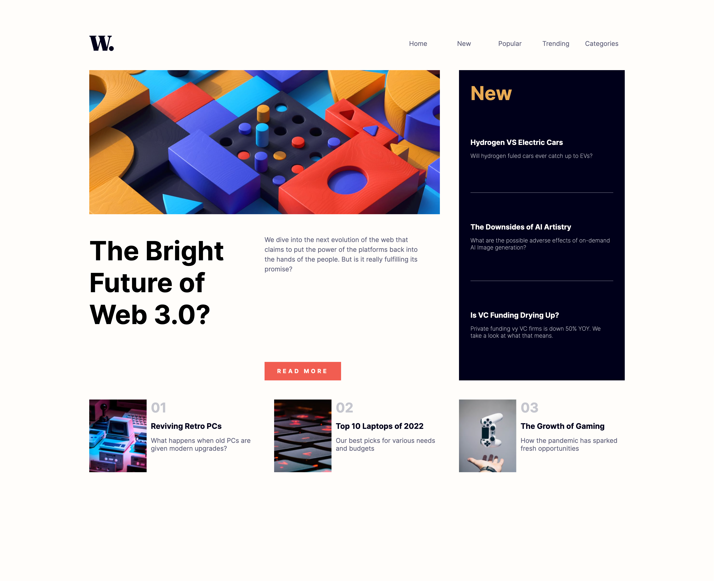
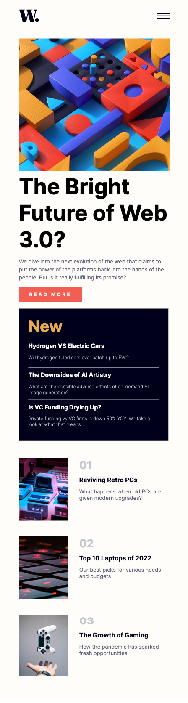

# Frontend Mentor - News homepage solution

This is a solution to the [News homepage challenge on Frontend Mentor](https://www.frontendmentor.io/challenges/news-homepage-H6SWTa1MFl). Frontend Mentor challenges help you improve your coding skills by building realistic projects.

## Table of contents

- [Overview](#overview)
  - [The challenge](#the-challenge)
  - [Screenshot](#screenshot)
  - [Links](#links)
- [My process](#my-process)
  - [Built with](#built-with)
  - [What I learned](#what-i-learned)
  - [Continued development](#continued-development)
- [Author](#author)

## Overview

### The challenge

Users should be able to:

- View the optimal layout for the interface depending on their device's screen size
- See hover and focus states for all interactive elements on the page

### Screenshot

### Links

- Solution URL: [Github repo](https://github.com/justincbal/Frontend-Mentor/tree/main/news-homepage-main)
- Live Site URL: [Live preview](https://news-homepage-frontend-mentor-iota.vercel.app/)
- Challenge URL: [Challenge](https://www.frontendmentor.io/challenges/news-homepage-H6SWTa1MFl)

## My process

### Built with

- Semantic HTML5 markup
- CSS custom properties
- Flexbox
- CSS Grid
- [React](https://reactjs.org/) - JS library

### What I learned

In this challenge I got to really practice using grid layouts. The main issues I was having was having the grid items fill the space I wanted them to, as well as aligning them and sizing them. It took a lot of playing around to figure out what worked. 

### Continued development

I've attempted to use flexbox for some layouts, but ended up switching to grid because I understand grid more and it's easier for me. That being said, for future development I want to go at it again using flex, and try to really learn how to use it properly.

## Author

- Github - [justincbal](https://github.com/justincbal)
- Frontend Mentor - [@justincbal](https://www.frontendmentor.io/profile/justincbal)
- LinkedIn - [@justincbal](https://www.linkedin.com/in/justincbal/)

