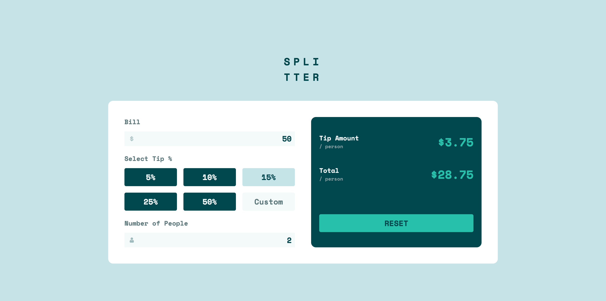
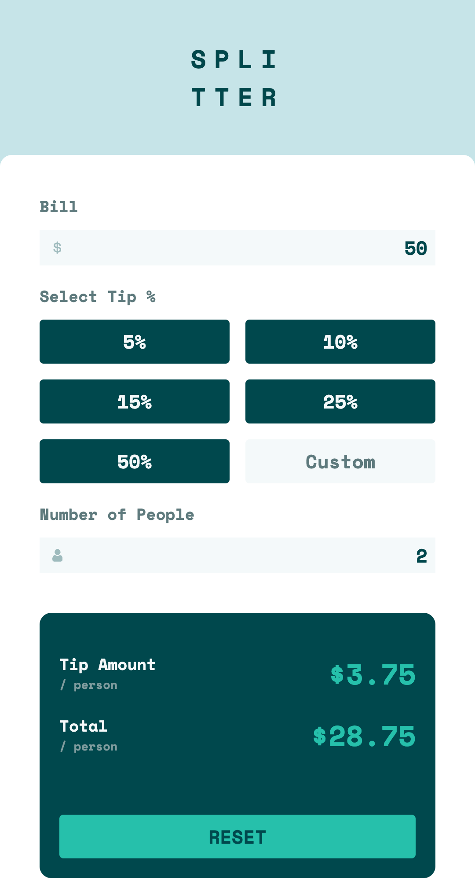

# Frontend Mentor - Tip calculator app solution

This is a solution to the [Tip calculator app challenge on Frontend Mentor](https://www.frontendmentor.io/challenges/tip-calculator-app-ugJNGbJUX). Frontend Mentor challenges help you improve your coding skills by building realistic projects.

## Table of contents

- [Overview](#overview)
  - [The challenge](#the-challenge)
  - [Screenshot](#screenshot)
  - [Links](#links)
- [My process](#my-process)
  - [Built with](#built-with)
  - [What I learned](#what-i-learned)
  - [Continued development](#continued-development)
- [Author](#author)

## Overview

### The challenge

Users should be able to:

- View the optimal layout for the app depending on their device's screen size
- See hover states for all interactive elements on the page
- Calculate the correct tip and total cost of the bill per person

### Screenshot

### Links

- Solution URL: [Repository](https://github.com/justincbal/Frontend-Mentor/tree/main/tip-calculator-app-main)
- Live Site URL: [Live preview](https://tip-calculator-frontend-mentor-eight.vercel.app/)

### Built with

- Semantic HTML5 markup
- CSS custom properties
- Flexbox
- CSS Grid
- Mobile-first workflow
- [React](https://reactjs.org/) - JS library

### What I learned

I tried a mobile first approach, and found it easier to create a more responsive layout from there. 

### Continued development

I managed state through useState, but I for future projects I want to try to implement the use of createContext to prevent prop drilling.

Since this was such as small project I didn't see the need to make the switch.

## Author

- Github - [justincbal](https://github.com/justincbal)
- Frontend Mentor - [@justincbal](https://www.frontendmentor.io/profile/justincbal)
- LinkedIn - [@justincbal](https://www.linkedin.com/in/justincbal/)

